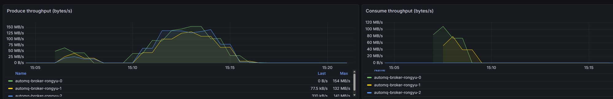
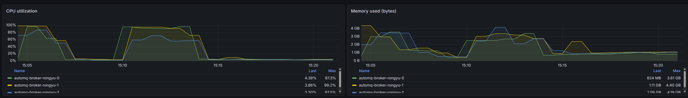
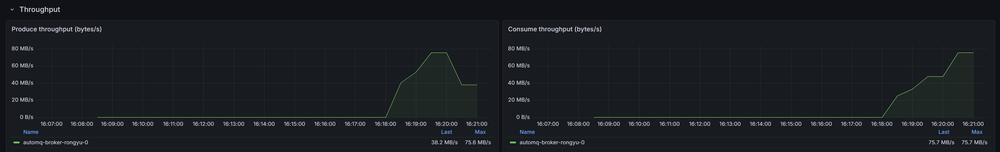
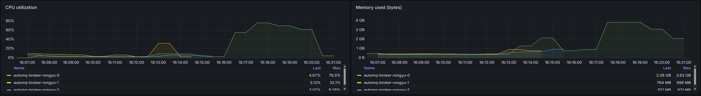
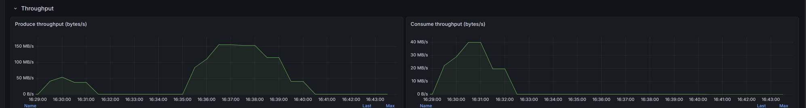
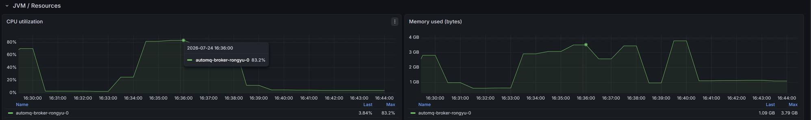

# AutoMQ on HDFS(WebHDFS)性能测试记录

> 本文件只记录**测试参数、集群配置、详细结果**三项。详细分析另做,此处只在顶部给结论。
> 与旧文件 `PERF-TEST-LOG.md` 的区别:本轮使用更新后的 `hdfs-perf-load.sh`
> (新增 WALL-CLOCK 口径、`RECORD_SIZES` 支持 KB 简写),并固定单一 record size 扫 producer。

---

## 测试结论

**延迟判定标准**:可接受的写延迟应控制在 **2 秒附近或以下**。延迟(尤其 p99 / max)一旦到 **3–4 秒**即视为不可接受——**此时即使吞吐数字高,也不是稳定可靠的结果,必须标注**。下表"可靠性"列即据此判定。

数据口径:吞吐 = 客户端 `SUM`(乐观上界)/ `WALL-CLOCK`(诚实下界);`server 峰值` = Grafana broker 端 produce throughput 实测。延迟取每档 per-producer 的 avg / p99 / max 范围。

### 1. 单节点(单 broker)

| producer | 吞吐 SUM / WALL(MB/s) | server 峰值 | 延迟 p99 / max | 可靠性 | 来源 |
|---|---|---|---|---|---|
| 2 | 78 / 67 | — | ~1.7s / ~2.2s | ✅ 可靠 | G7 |
| 4 | 144–150 / 123–126 | **156**(长跑,CPU 83%) | ~1.6–2.1s / ~1.9–2.9s | ✅ 可靠(临界) | G5/G7/G8 |
| 6 | 164–170 / 140–143 | — | ~2.4–2.7s / ~2.7–3.6s | ⚠️ 延迟超 2s,不稳定 | G5/G7 |
| 12 | 134 / 110 | — | ~6–8s / ~7–11s | ❌ 严重超标(吞吐反降) | G5 |

- **单节点最高吞吐(server 端实测):~156 MB/s**(16KB / 4 producer 长跑,G8;此时 CPU ~83%,接近单 pod 4 core 上限)。
- **单节点稳定吞吐(延迟达标):~150 MB/s(SUM)/ ~125 MB/s(WALL),在 4 producer**。此点 p99≈2s、max≈2.5s,仍在可接受边界。
- 再加并发(6/12 producer)吞吐**不再上升甚至下降**,而延迟迅速恶化到 3s 以上乃至 7–11s → **不可靠**。
- 单 broker 12 producer 曾多次堆爆 / 延迟爆炸,不建议单节点跑高并发。

### 2. 三 broker

| producer(16KB) | 吞吐 SUM / WALL(MB/s) | 延迟 p99 / max | 可靠性 | 来源 |
|---|---|---|---|---|
| 4 | 342 / 241 | ~0.7–0.8s / ~0.8–1.2s | ✅ 可靠(优) | G1 |
| 6 | **369 / 261** | ~1.2–1.5s / ~1.4–1.7s | ✅ 可靠 | G1 |
| 12 | 365 / 265 | ~2.3–3.0s / ~3.1–3.7s | ⚠️ 延迟超 2s,不稳定 | G1 |

- **三 broker 稳定吞吐峰值:~369 MB/s(SUM)/ ~261 MB/s(WALL),在 6 producer / 16KB**,延迟 p99<1.5s、max<1.7s,**稳定可靠**。
- **长跑 server 端峰值**:16KB / 6 producer 长跑三 broker produce 各自 Max 154+132+141 ≈ **~427 MB/s**(G4,非同刻求和;该轮 CPU 90–99%、撞 HDFS quota,属压力上限而非稳定值)。
- **12 producer 不增吞吐**(365 ≈ 6p 的 369)**却把延迟推到 3–4s** → 不可靠,不是有效工作点。
- 其他 record size 稳定峰值:1KB 6p 291/175(延迟达标);64KB 6p 365/276(max ~2.4s 临界),64KB 12p 延迟飙到 5–7s ❌。

### 3. 横向扩(单节点 → 三 broker)

- 稳定吞吐:单节点 ~150 → 三 broker ~369(SUM,16KB),约 **2.4×**;且同并发下三 broker 延迟远低于单节点(负载分摊)。
- 结论:**加 broker 同时提升了吞吐上限并降低了延迟**,横向扩有效。
- 两种拓扑的共同拐点特征:**producer 增到延迟 p99/max 突破 2s 时,吞吐已不再上升** —— 该点即最佳工作点(单节点≈4 producer,三 broker≈6 producer)。

> 注:所有 server 峰值来自 Grafana 面板的 Max 列,为各 broker 各自峰值(不一定同刻),属上界口径;稳定值以延迟达标档的客户端 SUM/WALL 为准。

---

## 测试记录索引

| 编号 | 日期 | 集群 | 内容 | record size | producer 档位 |
|---|---|---|---|---|---|
| G1 | 2026-07-24 | 3 broker | 固定 16KB,producer sweep | 16KB | 4 / 6 / 12 |
| G2 | 2026-07-24 | 3 broker | 固定 1KB,producer sweep | 1KB | 4 / 6 / 12 |
| G3 | 2026-07-24 | 3 broker | 固定 64KB,producer sweep | 64KB | 4 / 6 / 12 |
| G4 | 2026-07-24 | 3 broker | 16KB / 6 producer 长跑(quota error 中断) | 16KB | 6 |
| G5 | 2026-07-24 | 单节点 | 单 broker 16KB,producer sweep + 监控 | 16KB | 4 / 6 / 12 |
| G6 | 2026-07-24 | 单节点 | 单 broker 1KB,producer sweep | 1KB | 2 / 4 / 6 |
| G7 | 2026-07-24 | 单节点 | 单 broker 16KB,producer sweep(低档) | 16KB | 2 / 4 / 6 |
| G8 | 2026-07-24 | 单节点 | 单 broker 16KB / 4 producer 长跑(quota limit 中断)+ 监控 | 16KB | 4 |

---

## 集群配置

| 项 | Broker | Controller | Client(压测 pod) |
|---|---|---|---|
| replicas | 3 | 3(KIP-853 动态 quorum) | 1 |
| CPU requests/limits | 4000m | 2000m | 8000m |
| Mem requests/limits | 16G | 6G | 12G |
| `KAFKA_HEAP_OPTS` | `-Xms4g -Xmx4g -XX:MetaspaceSize=96m -XX:MaxDirectMemorySize=8G` | `-Xms1g -Xmx2g -XX:MetaspaceSize=96m` | `-Xms256m -Xmx512m`(producer JVM) |
| 镜像 | `msbingmtcr.azurecr.io/rongyu/automq:test0712sr` | 同左 | 同左 |
| `KAFKA_CFG_S3_WAL_PATH` | `-3@hdfs://automq?endpoint=…/user/rongyu/test/falcon/wal` | 同左 | — |
| `KAFKA_CFG_S3_DATA_BUCKETS` | `0@hdfs://automq?endpoint=…/user/rongyu/test/falcon/data` | 同左 | — |
| `KAFKA_CFG_S3_STREAM_ALLOCATOR_POLICY` | `POOLED_DIRECT` | `POOLED_DIRECT` | — |
| WebHDFS 网关 | `hdfs-http-ipv4-mtprime-dube01-0.magnetar.binginternal.com:83`(MTPrime-DUBE01-0) | 同左 | — |

**WAL Object 参数**(`KAFKA_CFG_S3_WAL_PATH` 未附加 query,全部默认):
`maxBytesInBatch=8388608`(8 MiB)、`batchInterval=250ms`、`maxInflightUploadCount=50`、`maxUnflushedBytes=1 GiB`。

---

## 测试方法与固定参数

- 脚本:`hdfs-perf-load.sh`(更新后版本),从独立 client pod 执行,`kubectl exec`。
- bootstrap:`automq-broker-rongyu.magnetar-test.svc.clusterset.local:9092`(跨集群 headless DNS)。
- 每档独立一次 `kubectl exec`,档间 `Start-Sleep 60s`。

| 参数 | 值 |
|---|---|
| `TOPIC_PREFIX` | `three-b` |
| `RECORD_SIZES` | `16`(= 16384 字节,固定) |
| `PARTITIONS` | 12 |
| `TARGET_SECS` | 60(默认) |
| `BATCH`(batch.size) | 1048576(1 MiB) |
| `LINGER`(linger.ms) | 100 |
| `acks` | all |
| `RUN_CONSUMER` | 1(默认,每档跑 consumer fetch) |
| `--num-records`/producer | 46080(由 TARGET_SECS 反算) |

**吞吐三口径说明**(参数含义,读结果前先看):

本报告每档吞吐同时给两个客户端口径 + 一个 server 口径。**两个客户端口径不是重复,而是刻意给出真实吞吐的"上界"和"下界",真值落在二者之间。**

- **SUM-OF-PRODUCERS(各 producer 自报之和 = 乐观上界)**
  - **算法**:每个 `kafka-producer-perf-test.sh` 进程跑完会自报一个平均 MB/s(= 它自己发的总字节 ÷ 它自己的运行时长)。脚本把 N 个 producer 的这个自报值**直接相加**。
  - **为什么偏高(上界)**:每个 producer 用的是**自己的**时间窗算速率,而这些进程并非同时启停(`xargs -P` 随机拉起,快的先跑完、慢的还在跑)。求和相当于**假设所有 producer 的峰值速率完全重叠**,把各自最快的瞬间叠在一起。现实中不可能完全重叠,所以这个数**系统性偏高**,是真实吞吐的**上界**。producer 越多、启停越参差,虚高越明显。
  - **用途**:跨档同口径对比(找拐点、比横向扩加速比)完全可用;但不能当作"对外可宣称的稳定吞吐"。

- **WALL-CLOCK AGG(总字节 / 墙上时间 = 诚实下界)**
  - **算法**:`所有 producer 发的总字节 ÷ 整段墙上时间`,其中墙上时间 = 从**第一个** producer 启动到**最后一个** producer 结束(同一个共享时间窗)。
  - **为什么偏低(下界)**:分母用的是最宽的时间窗,但这段窗口的**头尾**并非满并发(启动阶段还没都拉起、收尾阶段快的已退出)。等于"峰值并发的数据量 ÷ 含非满速头尾的总时长",被**稀释**,所以**几乎总是偏低**,是真实吞吐的**下界**。case 跑得越短(启停头尾占比越大),稀释越重、下界压得越低;跑得越久(如 G4/G8 长跑),SUM 与 WALL-CLOCK 越收敛、越接近真值。
  - **注意**:它是"实践下界",非数学严格下界——若所有 producer 完美同时启停,它就等于真值。

- **真值区间**:`WALL-CLOCK ≤ 真实吞吐 ≤ SUM`。因本轮多数 case 跑得较短(十几~几十秒),稀释较重,真值通常更靠近 SUM 一侧。

- **SERVER BytesIn / produce throughput(server 端权威)**
  - `kafka BytesInPerSec` 由 broker 在**成功 append 之后**才计数,跨所有 producer 在**同一时间窗**聚合,不受客户端多进程启停参差影响 → 最权威。可用 PromQL `sum(rate(kafka_broker_network_io_bytes_total{host_name=~"automq-broker-rongyu.*",direction="in"}[30s]))/1048576` 读,或直接看 Grafana produce 面板的平台/Max 值。
  - 本轮短跑档多数**未逐档采集**(留空);长跑档(G4/G5/G8)从 Grafana 面板读到了 server 峰值,已记录。
  - 注意:Grafana 面板 Max 列是**各 broker 各自峰值**(不一定同刻),属上界口径。

---

# G1:3 broker,固定 16KB,producer 4 / 6 / 12(2026-07-24)

命令:
```
kubectl exec -it -n magnetar-test $client -- env \
  BOOT=automq-broker-rongyu.magnetar-test.svc.clusterset.local:9092 \
  TOPIC_PREFIX=three-b RECORD_SIZES=16 PRODUCERS=<4|6|12> bash /tmp/load.sh
```

## G1 汇总:吞吐(MB/s)

| producers | SUM(上界) | WALL-CLOCK(下界) | SERVER BytesIn | consumer fetch.MB.sec |
|---|---|---|---|---|
| 4 | 341.86 | 241.00 | 未采集 | 556.42 |
| 6 | 369.20 | 260.87 | 未采集 | 588.76 |
| 12 | 365.06 | 265.19 | 未采集 | 598.46 |

## G1 汇总:数据量与耗时

| producers | recs/producer | total records | total data | wall clock | consumer fetch.nMsg.sec |
|---|---|---|---|---|---|
| 4 | 46080 | 184320 | 2880 MB | 11.95s | 35610.56 |
| 6 | 46080 | 276480 | 4320 MB | 16.56s | 37680.38 |
| 12 | 46080 | 552960 | 8640 MB | 32.58s | 38301.44 |

---

## G1-P4:4 producers(16KB)

**per-producer(原始逐行):**

| # | records | rec/s | MB/s | avg(ms) | p50 | p95 | p99 | p99.9 | max(ms) |
|---|---|---|---|---|---|---|---|---|---|
| 1 | 46080 | 5289.86 | 82.65 | 291.93 | 248 | 631 | 777 | 1025 | 1028 |
| 2 | 46080 | 5645.68 | 88.21 | 278.40 | 234 | 599 | 807 | 1188 | 1192 |
| 3 | 46080 | 5379.41 | 84.05 | 288.55 | 246 | 608 | 728 | 805 | 808 |
| 4 | 46080 | 5564.55 | 86.95 | 280.36 | 253 | 548 | 702 | 772 | 848 |

**aggregate:** SUM 341.86 MB/s / WALL-CLOCK 241.00 MB/s / wall 11.95s / total records 184320
**consumer:** fetch.MB.sec 556.4151 / fetch.nMsg.sec 35610.5649 / data 2886.1250 MB / fetch.time 5187ms / rebalance 3592ms

---

## G1-P6:6 producers(16KB)

**per-producer(原始逐行):**

| # | records | rec/s | MB/s | avg(ms) | p50 | p95 | p99 | p99.9 | max(ms) |
|---|---|---|---|---|---|---|---|---|---|
| 1 | 46080 | 4113.55 | 64.27 | 347.93 | 268 | 869 | 1192 | 1398 | 1424 |
| 2 | 46080 | 3782.94 | 59.11 | 386.33 | 257 | 1060 | 1378 | 1677 | 1706 |
| 3 | 46080 | 3716.73 | 58.07 | 382.36 | 258 | 1057 | 1473 | 1990 | 1996 |
| 4 | 46080 | 3934.76 | 61.48 | 377.44 | 277 | 990 | 1351 | 1753 | 1853 |
| 5 | 46080 | 4059.91 | 63.44 | 357.33 | 245 | 1007 | 1323 | 2045 | 2048 |
| 6 | 46080 | 4021.29 | 62.83 | 351.19 | 239 | 999 | 1361 | 1731 | 1741 |

**aggregate:** SUM 369.20 MB/s / WALL-CLOCK 260.87 MB/s / wall 16.56s / total records 276480
**consumer:** fetch.MB.sec 588.7559 / fetch.nMsg.sec 37680.3759 / data 4323.2344 MB / fetch.time 7343ms / rebalance 3582ms

---

## G1-P12:12 producers(16KB)

**per-producer(原始逐行):**

| # | records | rec/s | MB/s | avg(ms) | p50 | p95 | p99 | p99.9 | max(ms) |
|---|---|---|---|---|---|---|---|---|---|
| 1 | 46080 | 1981.68 | 30.96 | 676.71 | 457 | 1811 | 2340 | 3062 | 3076 |
| 2 | 46080 | 1982.87 | 30.98 | 651.60 | 458 | 1778 | 2305 | 3686 | 3706 |
| 3 | 46080 | 1924.25 | 30.07 | 744.39 | 565 | 1990 | 2596 | 3352 | 3363 |
| 4 | 46080 | 1881.89 | 29.40 | 745.74 | 528 | 1882 | 2357 | 3083 | 3094 |
| 5 | 46080 | 2012.31 | 31.44 | 672.69 | 491 | 1719 | 2495 | 3057 | 3063 |
| 6 | 46080 | 1911.56 | 29.87 | 784.90 | 624 | 2157 | 2994 | 3560 | 3579 |
| 7 | 46080 | 2080.55 | 32.51 | 647.03 | 406 | 1781 | 2488 | 2792 | 2806 |
| 8 | 46080 | 1929.89 | 30.15 | 710.79 | 489 | 2081 | 2757 | 3454 | 3459 |
| 9 | 46080 | 1914.73 | 29.92 | 730.80 | 564 | 2012 | 2533 | 3484 | 3550 |
| 10 | 46080 | 1926.90 | 30.11 | 684.47 | 470 | 1806 | 2697 | 3276 | 3292 |
| 11 | 46080 | 1937.68 | 30.28 | 695.17 | 481 | 1898 | 2466 | 3167 | 3175 |
| 12 | 46080 | 1879.44 | 29.37 | 755.02 | 508 | 1993 | 2791 | 3929 | 3950 |

**aggregate:** SUM 365.06 MB/s / WALL-CLOCK 265.19 MB/s / wall 32.58s / total records 552960
**consumer:** fetch.MB.sec 598.4600 / fetch.nMsg.sec 38301.4400 / data 8644.1563 MB / fetch.time 14444ms / rebalance 3624ms

---

# G2:3 broker,固定 1KB,producer 4 / 6 / 12(2026-07-24)

命令:
```
kubectl exec -it -n magnetar-test $client -- env \
  BOOT=automq-broker-rongyu.magnetar-test.svc.clusterset.local:9092 \
  TOPIC_PREFIX=three-c RECORD_SIZES=1 PRODUCERS=<4|6|12> bash /tmp/load.sh
```
差异于 G1:record size = 1KB(1024B),TOPIC_PREFIX=three-c,档间 Start-Sleep 10s。其余参数同 G1。
--num-records/producer = 368640。

## G2 汇总:吞吐(MB/s)

| producers | SUM(上界) | WALL-CLOCK(下界) | SERVER BytesIn | consumer fetch.MB.sec |
|---|---|---|---|---|
| 4 | 250.09 | 151.58 | 未采集 | 343.35 |
| 6 | 290.60 | 175.47 | 未采集 | 537.85 |
| 12 | 280.93 | 178.88 | 未采集 | 599.37 |

## G2 汇总:数据量与耗时

| producers | recs/producer | total records | total data | wall clock | consumer fetch.nMsg.sec |
|---|---|---|---|---|---|
| 4 | 368640 | 1474560 | 1440 MB | 9.50s | 351587.98 |
| 6 | 368640 | 2211840 | 2160 MB | 12.31s | 550762.20 |
| 12 | 368640 | 4423680 | 4320 MB | 24.15s | 613749.72 |

---

## G2-P4:4 producers(1KB)

**per-producer(原始逐行):**

| # | records | rec/s | MB/s | avg(ms) | p50 | p95 | p99 | p99.9 | max(ms) |
|---|---|---|---|---|---|---|---|---|---|
| 1 | 368640 | 59305.02 | 57.92 | 210.29 | 176 | 445 | 765 | 788 | 1115 |
| 2 | 368640 | 67989.67 | 66.40 | 196.34 | 181 | 349 | 455 | 569 | 728 |
| 3 | 368640 | 65711.23 | 64.17 | 210.53 | 194 | 368 | 521 | 637 | 731 |
| 4 | 368640 | 63080.08 | 61.60 | 222.41 | 196 | 408 | 495 | 726 | 1079 |

**aggregate:** SUM 250.09 MB/s / WALL-CLOCK 151.58 MB/s / wall 9.50s / total records 1474560
**consumer:** fetch.MB.sec 343.3476 / fetch.nMsg.sec 351587.9828 / data 1440.0000 MB / fetch.time 4194ms / rebalance 3579ms

---

## G2-P6:6 producers(1KB)

**per-producer(原始逐行):**

| # | records | rec/s | MB/s | avg(ms) | p50 | p95 | p99 | p99.9 | max(ms) |
|---|---|---|---|---|---|---|---|---|---|
| 1 | 368640 | 50298.81 | 49.12 | 202.95 | 177 | 368 | 601 | 713 | 1105 |
| 2 | 368640 | 46551.33 | 45.46 | 211.51 | 166 | 478 | 857 | 1191 | 1287 |
| 3 | 368640 | 45680.30 | 44.61 | 222.78 | 182 | 460 | 869 | 1123 | 1369 |
| 4 | 368640 | 51550.83 | 50.34 | 200.12 | 175 | 401 | 514 | 593 | 1103 |
| 5 | 368640 | 48787.72 | 47.64 | 234.00 | 182 | 575 | 808 | 862 | 1343 |
| 6 | 368640 | 54710.60 | 53.43 | 203.78 | 180 | 367 | 488 | 551 | 1030 |

**aggregate:** SUM 290.60 MB/s / WALL-CLOCK 175.47 MB/s / wall 12.31s / total records 2211840
**consumer:** fetch.MB.sec 537.8537 / fetch.nMsg.sec 550762.2012 / data 2160.0205 MB / fetch.time 4016ms / rebalance 3762ms

---

## G2-P12:12 producers(1KB)

**per-producer(原始逐行):**

| # | records | rec/s | MB/s | avg(ms) | p50 | p95 | p99 | p99.9 | max(ms) |
|---|---|---|---|---|---|---|---|---|---|
| 1 | 368640 | 23749.52 | 23.19 | 518.98 | 352 | 1385 | 1660 | 1914 | 2755 |
| 2 | 368640 | 23031.36 | 22.49 | 457.71 | 372 | 1019 | 1314 | 1520 | 3126 |
| 3 | 368640 | 24410.01 | 23.84 | 474.45 | 314 | 1310 | 1792 | 1898 | 2023 |
| 4 | 368640 | 22116.63 | 21.60 | 481.45 | 337 | 1198 | 1969 | 2265 | 2330 |
| 5 | 368640 | 24908.11 | 24.32 | 465.72 | 310 | 1165 | 1512 | 1610 | 2209 |
| 6 | 368640 | 22953.92 | 22.42 | 574.34 | 369 | 1561 | 1981 | 2358 | 2377 |
| 7 | 368640 | 24196.91 | 23.63 | 447.66 | 288 | 1226 | 1752 | 2031 | 2034 |
| 8 | 368640 | 24476.46 | 23.90 | 448.50 | 298 | 1167 | 1599 | 2078 | 2623 |
| 9 | 368640 | 25492.01 | 24.89 | 397.22 | 276 | 1097 | 1792 | 2320 | 2330 |
| 10 | 368640 | 23080.39 | 22.54 | 511.93 | 362 | 1271 | 1732 | 2124 | 2824 |
| 11 | 368640 | 24393.86 | 23.82 | 434.37 | 304 | 1167 | 1747 | 2217 | 2220 |
| 12 | 368640 | 24872.82 | 24.29 | 381.10 | 284 | 954 | 1307 | 1591 | 1594 |

**aggregate:** SUM 280.93 MB/s / WALL-CLOCK 178.88 MB/s / wall 24.15s / total records 4423680
**consumer:** fetch.MB.sec 599.3650 / fetch.nMsg.sec 613749.7225 / data 4320.2227 MB / fetch.time 7208ms / rebalance 3818ms

---

# G3:3 broker,固定 64KB,producer 4 / 6 / 12(2026-07-24)

命令:
```
kubectl exec -it -n magnetar-test $client -- env \
  BOOT=automq-broker-rongyu.magnetar-test.svc.clusterset.local:9092 \
  TOPIC_PREFIX=three-c RECORD_SIZES=64 PRODUCERS=<4|6|12> bash /tmp/load.sh
```
差异于 G1:record size = 64KB(65536B),TOPIC_PREFIX=three-c,档间 Start-Sleep 10s。其余参数同 G1。
--num-records/producer = 14400。

## G3 汇总:吞吐(MB/s)

| producers | SUM(上界) | WALL-CLOCK(下界) | SERVER BytesIn | consumer fetch.MB.sec |
|---|---|---|---|---|
| 4 | 340.61 | 252.10 | 未采集 | 636.38 |
| 6 | 364.56 | 275.51 | 未采集 | 692.41 |
| 12 | 337.35 | 263.93 | 未采集 | 644.34 |

## G3 汇总:数据量与耗时

| producers | recs/producer | total records | total data | wall clock | consumer fetch.nMsg.sec |
|---|---|---|---|---|---|
| 4 | 14400 | 57600 | 3600 MB | 14.28s | 10182.08 |
| 6 | 14400 | 86400 | 5400 MB | 19.60s | 11078.59 |
| 12 | 14400 | 172800 | 10800 MB | 40.92s | 10309.47 |

---

## G3-P4:4 producers(64KB)

**per-producer(原始逐行):**

| # | records | rec/s | MB/s | avg(ms) | p50 | p95 | p99 | p99.9 | max(ms) |
|---|---|---|---|---|---|---|---|---|---|
| 1 | 14400 | 1402.28 | 87.64 | 289.14 | 245 | 620 | 874 | 1073 | 1079 |
| 2 | 14400 | 1393.73 | 87.11 | 291.29 | 254 | 591 | 799 | 1043 | 1086 |
| 3 | 14400 | 1317.23 | 82.33 | 306.50 | 247 | 730 | 965 | 1095 | 1101 |
| 4 | 14400 | 1336.55 | 83.53 | 302.15 | 255 | 688 | 917 | 1170 | 1215 |

**aggregate:** SUM 340.61 MB/s / WALL-CLOCK 252.10 MB/s / wall 14.28s / total records 57600
**consumer:** fetch.MB.sec 636.3797 / fetch.nMsg.sec 10182.0753 / data 3600.0000 MB / fetch.time 5657ms / rebalance 3579ms

---

## G3-P6:6 producers(64KB)

**per-producer(原始逐行):**

| # | records | rec/s | MB/s | avg(ms) | p50 | p95 | p99 | p99.9 | max(ms) |
|---|---|---|---|---|---|---|---|---|---|
| 1 | 14400 | 958.34 | 59.90 | 423.07 | 295 | 1144 | 1570 | 1956 | 1968 |
| 2 | 14400 | 997.58 | 62.35 | 386.71 | 280 | 991 | 1317 | 1668 | 1682 |
| 3 | 14400 | 960.64 | 60.04 | 418.39 | 280 | 1114 | 1510 | 2422 | 2444 |
| 4 | 14400 | 969.89 | 60.62 | 418.58 | 290 | 1122 | 1585 | 2403 | 2407 |
| 5 | 14400 | 1015.01 | 63.44 | 377.81 | 304 | 906 | 1310 | 1619 | 1640 |
| 6 | 14400 | 931.38 | 58.21 | 427.26 | 295 | 1152 | 1733 | 2167 | 2191 |

**aggregate:** SUM 364.56 MB/s / WALL-CLOCK 275.51 MB/s / wall 19.60s / total records 86400
**consumer:** fetch.MB.sec 692.4117 / fetch.nMsg.sec 11078.5870 / data 5409.8125 MB / fetch.time 7813ms / rebalance 3569ms

---

## G3-P12:12 producers(64KB)

**per-producer(原始逐行):**

| # | records | rec/s | MB/s | avg(ms) | p50 | p95 | p99 | p99.9 | max(ms) |
|---|---|---|---|---|---|---|---|---|---|
| 1 | 14400 | 461.33 | 28.83 | 869.71 | 458 | 2522 | 5143 | 5746 | 5797 |
| 2 | 14400 | 441.39 | 27.59 | 919.10 | 577 | 2598 | 5493 | 6163 | 6171 |
| 3 | 14400 | 450.85 | 28.18 | 896.17 | 551 | 2467 | 5082 | 6622 | 6629 |
| 4 | 14400 | 449.79 | 28.11 | 878.39 | 521 | 2295 | 5447 | 6550 | 6595 |
| 5 | 14400 | 431.38 | 26.96 | 930.51 | 574 | 2725 | 5052 | 6184 | 6253 |
| 6 | 14400 | 446.57 | 27.91 | 894.80 | 535 | 2589 | 5206 | 6639 | 6645 |
| 7 | 14400 | 449.65 | 28.10 | 914.72 | 627 | 2360 | 4860 | 5227 | 5288 |
| 8 | 14400 | 450.99 | 28.19 | 872.61 | 563 | 2482 | 5515 | 6926 | 6931 |
| 9 | 14400 | 447.58 | 27.97 | 904.67 | 501 | 3006 | 5200 | 6964 | 7005 |
| 10 | 14400 | 459.99 | 28.75 | 873.48 | 486 | 2645 | 5486 | 6122 | 6141 |
| 11 | 14400 | 451.74 | 28.23 | 889.51 | 550 | 2627 | 4940 | 5994 | 6010 |
| 12 | 14400 | 456.51 | 28.53 | 867.92 | 502 | 2389 | 5386 | 6318 | 6334 |

**aggregate:** SUM 337.35 MB/s / WALL-CLOCK 263.93 MB/s / wall 40.92s / total records 172800
**consumer:** fetch.MB.sec 644.3420 / fetch.nMsg.sec 10309.4727 / data 10801.7500 MB / fetch.time 16764ms / rebalance 3590ms

---

# G4:3 broker,16KB / 6 producer 长跑(TARGET_SECS=3200,中途 quota error 未跑完,2026-07-24)

命令:
```
kubectl exec -it -n magnetar-test $client -- env \
  BOOT=automq-broker-rongyu.magnetar-test.svc.clusterset.local:9092 \
  TOPIC_PREFIX=three-d RECORD_SIZES=16 TARGET_SECS=3200 PRODUCERS=6 bash /tmp/load.sh
```
差异于 G1:TARGET_SECS=3200(每 producer 2457600 条,目标 ~230400 MB),TOPIC_PREFIX=three-d,record 16KB。
**结果:压测跑了将近 5 分钟未跑完,出 quota error 中断**,脚本未打出 AGGREGATE/consumer 汇总。
下列数据取自 Grafana broker 端监控(server 侧)。

## G4 结果(server 端,取自 Grafana 面板 Max 列)

**Produce throughput(bytes/s,per broker,Max):**

| broker | Max produce | Last |
|---|---|---|
| automq-broker-rongyu-0 | 154 MB/s | 0 B/s |
| automq-broker-rongyu-1 | 132 MB/s | 77.5 kB/s |
| automq-broker-rongyu-2 | 141 MB/s | 310 kB/s |
| **三 broker Max 合计** | **~427 MB/s**(各自 Max 之和,非同刻) | — |

> 用户观测口径:压测中吞吐 154 + 132 + 127(≈413),CPU ~90%,mem 接近 4G。

**Consume throughput(bytes/s):** 峰值约 100–105 MB/s(broker-0 顶点最高,图示约 105 MB/s)。

**CPU utilization(Max):**

| broker | Max CPU |
|---|---|
| automq-broker-rongyu-0 | 97.3% |
| automq-broker-rongyu-1 | 99.2% |
| automq-broker-rongyu-2 | 87.5% |

**Memory used(bytes,Max):**

| broker | Last | Max |
|---|---|---|
| automq-broker-rongyu-0 | 824 MB | 3.61 GB |
| automq-broker-rongyu-1 | 1.11 GB | 4.40 GB |
| automq-broker-rongyu-2 | 1.09 GB | 4.19 GB |

**监控截图:**





---

# G5:单节点 broker,固定 16KB,producer 4 / 6 / 12 + 监控(2026-07-24)

命令:
```
kubectl exec -it -n magnetar-test $client -- env \
  BOOT=automq-broker-rongyu.magnetar-test.svc.clusterset.local:9092 \
  TOPIC_PREFIX=single2-a RECORD_SIZES=16 PRODUCERS=<4|6|12> bash /tmp/load.sh
```
差异于 G1:单节点(TOPIC_PREFIX=single2-a;Grafana produce 面板仅 broker-0 有流量,broker-1/2 空闲)。record 16KB,档间 Start-Sleep 10s。
> 备注:副本数未由本侧 kubectl 核实;判据来自监控图——produce throughput 仅 broker-0 一条曲线。

## G5 汇总:吞吐(MB/s)

| producers | SUM(上界) | WALL-CLOCK(下界) | SERVER produce(Grafana Max) | consumer fetch.MB.sec |
|---|---|---|---|---|
| 4 | 144.30 | 122.76 | 见下图 | 455.05 |
| 6 | 164.16 | 140.08 | 见下图 | 324.10 |
| 12 | 133.69 | 110.42 | 见下图 | 348.11 |

## G5 汇总:数据量与耗时

| producers | recs/producer | total records | total data | wall clock | consumer fetch.nMsg.sec |
|---|---|---|---|---|---|
| 4 | 46080 | 184320 | 2880 MB | 23.46s | 29123.08 |
| 6 | 46080 | 276480 | 4320 MB | 30.84s | 20742.57 |
| 12 | 46080 | 552960 | 8640 MB | 78.25s | 22278.72 |

## G5 server 端监控(取自 Grafana 面板)

**Produce throughput(broker-0,唯一有流量):** Last 38.2 MB/s / **Max 75.6 MB/s**
**Consume throughput(broker-0):** Last 75.7 MB/s / **Max 75.7 MB/s**

**CPU utilization(Max):**

| broker | Last | Max |
|---|---|---|
| automq-broker-rongyu-0 | 4.67% | 76.5% |
| automq-broker-rongyu-1 | 3.13% | 32.1% |
| automq-broker-rongyu-2 | 3.07% | 9.28% |

**Memory used(Max):**

| broker | Last | Max |
|---|---|---|
| automq-broker-rongyu-0 | 2.08 GB | 3.83 GB |
| automq-broker-rongyu-1 | 764 MB | 898 MB |
| automq-broker-rongyu-2 | 921 MB | 921 MB |

**监控截图:**





---

## G5-P4:4 producers(16KB,单节点)

**per-producer(原始逐行):**

| # | records | rec/s | MB/s | avg(ms) | p50 | p95 | p99 | p99.9 | max(ms) |
|---|---|---|---|---|---|---|---|---|---|
| 1 | 46080 | 2288.78 | 35.76 | 813.46 | 766 | 1648 | 2043 | 2549 | 2637 |
| 2 | 46080 | 2328.57 | 36.38 | 806.02 | 748 | 1522 | 1948 | 2690 | 2697 |
| 3 | 46080 | 2321.64 | 36.28 | 803.49 | 743 | 1630 | 2073 | 2325 | 2348 |
| 4 | 46080 | 2296.42 | 35.88 | 809.05 | 744 | 1636 | 2134 | 2802 | 2867 |

**aggregate:** SUM 144.30 MB/s / WALL-CLOCK 122.76 MB/s / wall 23.46s / total records 184320
**consumer:** fetch.MB.sec 455.0482 / fetch.nMsg.sec 29123.0842 / data 2880.0000 MB / fetch.time 6329ms / rebalance 3602ms

---

## G5-P6:6 producers(16KB,单节点)

**per-producer(原始逐行):**

| # | records | rec/s | MB/s | avg(ms) | p50 | p95 | p99 | p99.9 | max(ms) |
|---|---|---|---|---|---|---|---|---|---|
| 1 | 46080 | 1740.18 | 27.19 | 1077.11 | 1036 | 1968 | 2337 | 3079 | 3083 |
| 2 | 46080 | 1769.31 | 27.65 | 1059.58 | 988 | 2031 | 2510 | 3156 | 3239 |
| 3 | 46080 | 1766.94 | 27.61 | 1056.49 | 1014 | 1919 | 2251 | 2651 | 2656 |
| 4 | 46080 | 1755.76 | 27.43 | 1080.57 | 1021 | 2061 | 2484 | 3269 | 3347 |
| 5 | 46080 | 1753.16 | 27.39 | 1072.98 | 1003 | 2186 | 2582 | 2879 | 2883 |
| 6 | 46080 | 1720.82 | 26.89 | 1088.72 | 1031 | 2056 | 2611 | 3105 | 3113 |

**aggregate:** SUM 164.16 MB/s / WALL-CLOCK 140.08 MB/s / wall 30.84s / total records 276480
**consumer:** fetch.MB.sec 324.1027 / fetch.nMsg.sec 20742.5743 / data 4320.9375 MB / fetch.time 13332ms / rebalance 3585ms

---

## G5-P12:12 producers(16KB,单节点)

**per-producer(原始逐行):**

| # | records | rec/s | MB/s | avg(ms) | p50 | p95 | p99 | p99.9 | max(ms) |
|---|---|---|---|---|---|---|---|---|---|
| 1 | 46080 | 697.12 | 10.89 | 2719.76 | 2430 | 5859 | 7318 | 10714 | 10876 |
| 2 | 46080 | 700.14 | 10.94 | 2692.70 | 2513 | 5773 | 7354 | 9586 | 9774 |
| 3 | 46080 | 703.34 | 10.99 | 2677.74 | 2430 | 5715 | 7581 | 9567 | 9571 |
| 4 | 46080 | 738.88 | 11.54 | 2558.04 | 2371 | 5470 | 6479 | 8679 | 8751 |
| 5 | 46080 | 735.42 | 11.49 | 2533.05 | 2408 | 5177 | 6366 | 7977 | 8265 |
| 6 | 46080 | 688.72 | 10.76 | 2762.31 | 2526 | 5910 | 7195 | 8428 | 8514 |
| 7 | 46080 | 700.99 | 10.95 | 2685.69 | 2517 | 5605 | 6721 | 7392 | 7397 |
| 8 | 46080 | 656.80 | 10.26 | 2875.53 | 2583 | 6165 | 8268 | 9894 | 9899 |
| 9 | 46080 | 710.52 | 11.10 | 2657.47 | 2384 | 5895 | 7700 | 10492 | 10497 |
| 10 | 46080 | 767.91 | 12.00 | 2452.67 | 2228 | 5137 | 6475 | 8294 | 8637 |
| 11 | 46080 | 717.40 | 11.21 | 2609.37 | 2451 | 5635 | 7030 | 8213 | 8271 |
| 12 | 46080 | 740.16 | 11.56 | 2504.29 | 2411 | 5296 | 6807 | 9542 | 9551 |

**aggregate:** SUM 133.69 MB/s / WALL-CLOCK 110.42 MB/s / wall 78.25s / total records 552960
**consumer:** fetch.MB.sec 348.1050 / fetch.nMsg.sec 22278.7195 / data 8645.1875 MB / fetch.time 24835ms / rebalance 3583ms

---

# G6:单节点 broker,固定 1KB,producer 2 / 4 / 6(2026-07-24)

命令:
```
kubectl exec -it -n magnetar-test $client -- env \
  BOOT=automq-broker-rongyu.magnetar-test.svc.clusterset.local:9092 \
  TOPIC_PREFIX=single2-a RECORD_SIZES=1 PRODUCERS=<2|4|6> bash /tmp/load.sh
```
差异于 G1:单节点(TOPIC_PREFIX=single2-a),record size = 1KB(1024B),producer 档位 2/4/6,档间 Start-Sleep 10s。
--num-records/producer = 368640。

## G6 汇总:吞吐(MB/s)

| producers | SUM(上界) | WALL-CLOCK(下界) | SERVER BytesIn | consumer fetch.MB.sec |
|---|---|---|---|---|
| 2 | 70.51 | 55.13 | 未采集 | 242.83 |
| 4 | 130.51 | 97.17 | 未采集 | 393.30 |
| 6 | 160.53 | 117.84 | 未采集 | 347.35 |

## G6 汇总:数据量与耗时

| producers | recs/producer | total records | total data | wall clock | consumer fetch.nMsg.sec |
|---|---|---|---|---|---|
| 2 | 368640 | 737280 | 720 MB | 13.06s | 248661.05 |
| 4 | 368640 | 1474560 | 1440 MB | 14.82s | 402734.57 |
| 6 | 368640 | 2211840 | 2160 MB | 18.33s | 355681.51 |

---

## G6-P2:2 producers(1KB,单节点)

**per-producer(原始逐行):**

| # | records | rec/s | MB/s | avg(ms) | p50 | p95 | p99 | p99.9 | max(ms) |
|---|---|---|---|---|---|---|---|---|---|
| 1 | 368640 | 36344.28 | 35.49 | 742.83 | 680 | 1529 | 1946 | 2198 | 2202 |
| 2 | 368640 | 35856.43 | 35.02 | 771.31 | 702 | 1550 | 1801 | 1912 | 1915 |

**aggregate:** SUM 70.51 MB/s / WALL-CLOCK 55.13 MB/s / wall 13.06s / total records 737280
**consumer:** fetch.MB.sec 242.8331 / fetch.nMsg.sec 248661.0455 / data 720.0000 MB / fetch.time 2965ms / rebalance 3582ms

---

## G6-P4:4 producers(1KB,单节点)

**per-producer(原始逐行):**

| # | records | rec/s | MB/s | avg(ms) | p50 | p95 | p99 | p99.9 | max(ms) |
|---|---|---|---|---|---|---|---|---|---|
| 1 | 368640 | 32145.10 | 31.39 | 806.35 | 728 | 1648 | 2093 | 2280 | 2411 |
| 2 | 368640 | 32805.91 | 32.04 | 793.20 | 731 | 1592 | 1889 | 2063 | 2080 |
| 3 | 368640 | 34362.42 | 33.56 | 787.68 | 722 | 1555 | 2190 | 2412 | 2465 |
| 4 | 368640 | 34320.83 | 33.52 | 818.71 | 738 | 1594 | 1878 | 2134 | 2144 |

**aggregate:** SUM 130.51 MB/s / WALL-CLOCK 97.17 MB/s / wall 14.82s / total records 1474560
**consumer:** fetch.MB.sec 393.2955 / fetch.nMsg.sec 402734.5713 / data 1440.2480 MB / fetch.time 3662ms / rebalance 3586ms

---

## G6-P6:6 producers(1KB,单节点)

**per-producer(原始逐行):**

| # | records | rec/s | MB/s | avg(ms) | p50 | p95 | p99 | p99.9 | max(ms) |
|---|---|---|---|---|---|---|---|---|---|
| 1 | 368640 | 27306.67 | 26.67 | 849.27 | 805 | 1812 | 2197 | 2534 | 2551 |
| 2 | 368640 | 26427.70 | 25.81 | 897.11 | 841 | 1823 | 2228 | 2768 | 2771 |
| 3 | 368640 | 27127.82 | 26.49 | 847.65 | 771 | 1787 | 2170 | 2481 | 2513 |
| 4 | 368640 | 28755.07 | 28.08 | 921.81 | 849 | 1877 | 2216 | 2528 | 2532 |
| 5 | 368640 | 27250.15 | 26.61 | 880.93 | 842 | 1809 | 2146 | 2301 | 2316 |
| 6 | 368640 | 27514.55 | 26.87 | 877.12 | 852 | 1761 | 2155 | 2309 | 2315 |

**aggregate:** SUM 160.53 MB/s / WALL-CLOCK 117.84 MB/s / wall 18.33s / total records 2211840
**consumer:** fetch.MB.sec 347.3452 / fetch.nMsg.sec 355681.5113 / data 2160.4873 MB / fetch.time 6220ms / rebalance 3584ms

---

# G7:单节点 broker,固定 16KB,producer 2 / 4 / 6(2026-07-24)

命令:
```
kubectl exec -it -n magnetar-test $client -- env \
  BOOT=automq-broker-rongyu.magnetar-test.svc.clusterset.local:9092 \
  TOPIC_PREFIX=single2-2 RECORD_SIZES=16 PRODUCERS=<2|4|6> bash /tmp/load.sh
```
差异于 G1:单节点(TOPIC_PREFIX=single2-2),record 16KB,producer 档位 2/4/6,档间 Start-Sleep 10s。
--num-records/producer = 46080。

## G7 汇总:吞吐(MB/s)

| producers | SUM(上界) | WALL-CLOCK(下界) | SERVER BytesIn | consumer fetch.MB.sec |
|---|---|---|---|---|
| 2 | 77.89 | 66.64 | 未采集 | 412.37 |
| 4 | 150.50 | 125.71 | 未采集 | 377.55 |
| 6 | 170.32 | 143.47 | 未采集 | 351.11 |

## G7 汇总:数据量与耗时

| producers | recs/producer | total records | total data | wall clock | consumer fetch.nMsg.sec |
|---|---|---|---|---|---|
| 2 | 46080 | 92160 | 1440 MB | 21.61s | 26391.75 |
| 4 | 46080 | 184320 | 2880 MB | 22.91s | 24163.03 |
| 6 | 46080 | 276480 | 4320 MB | 30.11s | 22471.19 |

---

## G7-P2:2 producers(16KB,单节点)

**per-producer(原始逐行):**

| # | records | rec/s | MB/s | avg(ms) | p50 | p95 | p99 | p99.9 | max(ms) |
|---|---|---|---|---|---|---|---|---|---|
| 1 | 46080 | 2540.66 | 39.70 | 741.65 | 699 | 1383 | 1722 | 2113 | 2118 |
| 2 | 46080 | 2444.30 | 38.19 | 754.57 | 704 | 1453 | 1718 | 2210 | 2215 |

**aggregate:** SUM 77.89 MB/s / WALL-CLOCK 66.64 MB/s / wall 21.61s / total records 92160
**consumer:** fetch.MB.sec 412.3711 / fetch.nMsg.sec 26391.7526 / data 1440.0000 MB / fetch.time 3492ms / rebalance 3578ms

---

## G7-P4:4 producers(16KB,单节点)

**per-producer(原始逐行):**

| # | records | rec/s | MB/s | avg(ms) | p50 | p95 | p99 | p99.9 | max(ms) |
|---|---|---|---|---|---|---|---|---|---|
| 1 | 46080 | 2358.96 | 36.86 | 782.44 | 740 | 1531 | 1907 | 2612 | 2691 |
| 2 | 46080 | 2345.99 | 36.66 | 793.36 | 755 | 1467 | 1689 | 1854 | 1924 |
| 3 | 46080 | 2435.65 | 38.06 | 761.05 | 690 | 1484 | 1804 | 2263 | 2304 |
| 4 | 46080 | 2490.81 | 38.92 | 745.42 | 707 | 1417 | 1609 | 1993 | 1998 |

**aggregate:** SUM 150.50 MB/s / WALL-CLOCK 125.71 MB/s / wall 22.91s / total records 184320
**consumer:** fetch.MB.sec 377.5473 / fetch.nMsg.sec 24163.0250 / data 2885.5938 MB / fetch.time 7643ms / rebalance 3608ms

---

## G7-P6:6 producers(16KB,单节点)

**per-producer(原始逐行):**

| # | records | rec/s | MB/s | avg(ms) | p50 | p95 | p99 | p99.9 | max(ms) |
|---|---|---|---|---|---|---|---|---|---|
| 1 | 46080 | 1793.48 | 28.02 | 1043.26 | 962 | 2028 | 2402 | 2848 | 3035 |
| 2 | 46080 | 1842.76 | 28.79 | 1014.60 | 937 | 2080 | 2713 | 2911 | 2915 |
| 3 | 46080 | 1818.04 | 28.41 | 1025.06 | 944 | 2032 | 2612 | 3542 | 3613 |
| 4 | 46080 | 1833.15 | 28.64 | 1020.12 | 937 | 2105 | 2692 | 2987 | 2994 |
| 5 | 46080 | 1775.52 | 27.74 | 1040.95 | 982 | 2088 | 2620 | 3268 | 3309 |
| 6 | 46080 | 1837.98 | 28.72 | 1019.96 | 924 | 2072 | 2691 | 3524 | 3544 |

**aggregate:** SUM 170.32 MB/s / WALL-CLOCK 143.47 MB/s / wall 30.11s / total records 276480
**consumer:** fetch.MB.sec 351.1124 / fetch.nMsg.sec 22471.1906 / data 4320.4375 MB / fetch.time 12305ms / rebalance 3570ms

---

# G8:单节点 broker,16KB / 4 producer 长跑(TARGET_SECS=1000,quota limit 中断)+ 监控(2026-07-24)

命令:
```
kubectl exec -it -n magnetar-test $client -- env \
  BOOT=automq-broker-rongyu.magnetar-test.svc.clusterset.local:9092 \
  TOPIC_PREFIX=aa RECORD_SIZES=16 TARGET_SECS=1000 PRODUCERS=4 bash /tmp/load.sh
```
差异于 G1:单节点(TOPIC_PREFIX=aa),record 16KB,TARGET_SECS=1000(每 producer 768000 条,目标 ~48000 MB),producer=4。
**结果:长时间运行后卡住,hit HDFS quota limit 中断**,脚本未打出 AGGREGATE/consumer 汇总。下列数据取自 Grafana broker 端监控(单节点,仅 broker-0)。

## G8 结果(server 端,取自 Grafana 面板)

**Produce throughput(broker-0,单节点):峰值 ~156 MB/s**(图示曲线顶点略高于 150 MB/s;用户读数 156 MB/s)。
**Consume throughput(broker-0):** 峰值约 40 MB/s。
**CPU utilization(broker-0):** Max **83.2%**(tooltip 明确标注 2026-07-24 16:36:00 broker-0 = 83.2%)。
**Memory used(broker-0):** Last 1.09 GB / Max 3.79 GB。

**监控截图:**




